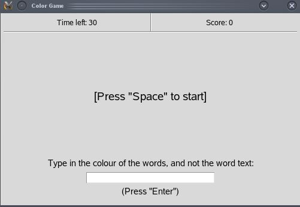
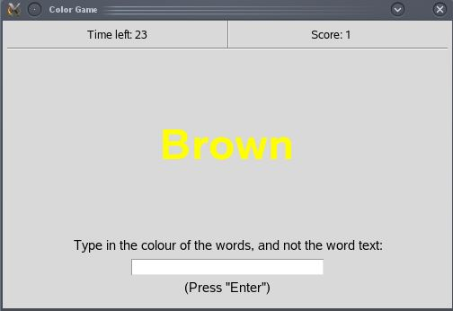
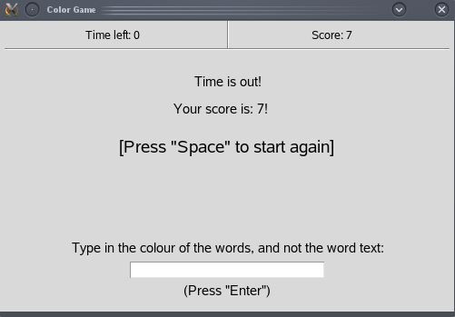

# Color-game
A simple game where you have limited time to type in the color of the words, and not the word text.

Made by [Eugeny Khanchin](https://github.com/eKhanchin) as an exercise of Python.
## Screenshots

